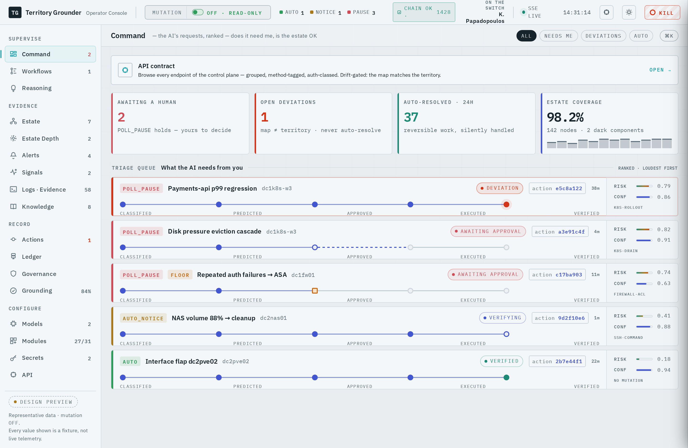
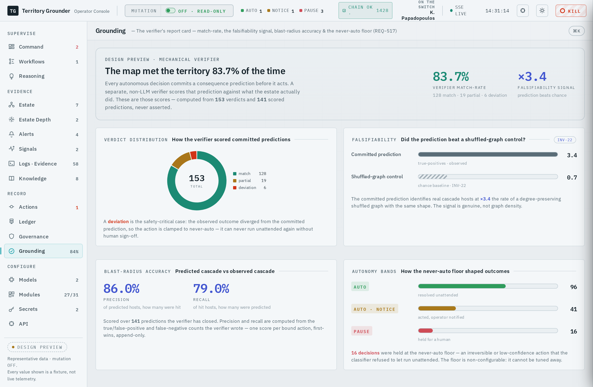
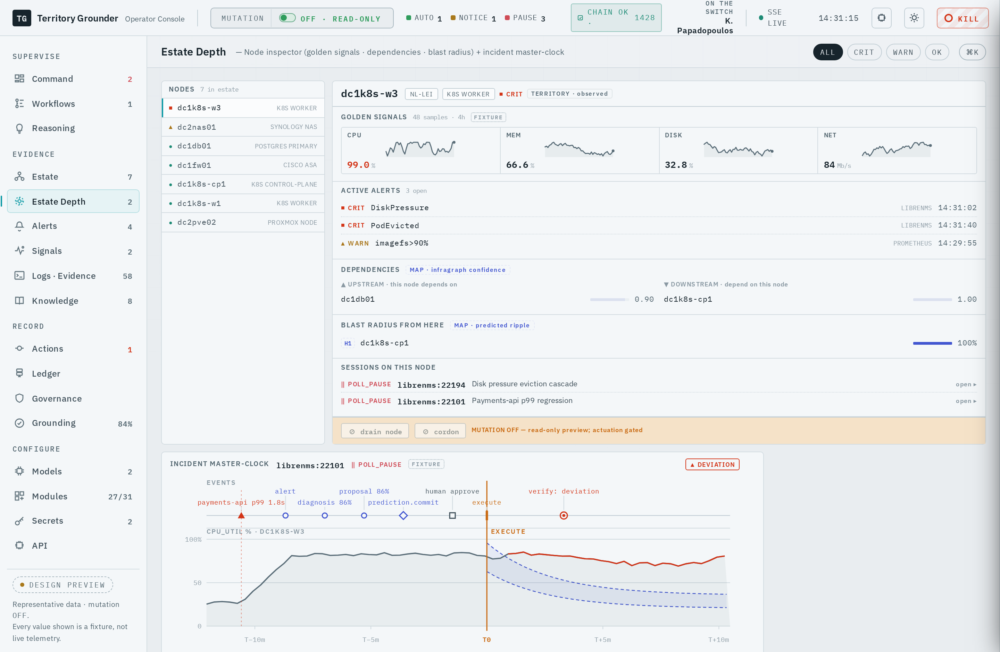
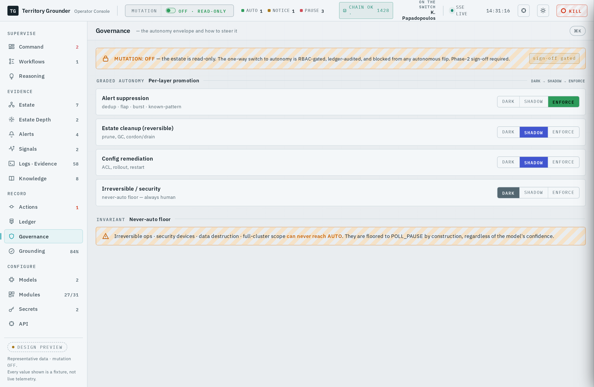

<div align="center">
  
</div>

<p align="center"><em>Autonomous remediation, grounded. It has a territory, a ledger, and a leash.</em></p>

<p align="center">
  <a href="LICENSE"></a>
  
  
  
  
</p>

**Territory Grounder** (`grounder`, alias `tg`) is an open-source, self-hosted governed-autonomy SRE
platform. It ingests alerts, chat, and tickets; lets a native LLM agent triage and (once evidenced-ready)
autonomously remediate infrastructure incidents across a whole estate (Kubernetes, hypervisors, network,
storage, security); and wraps that agent in governance strict enough to trust near production.

It is built for sovereign, regulated, and air-gapped estates. Everything runs inside the adopter's own
trust boundary with no SaaS dependency and no phone-home, and every decision is reconstructable from the
adopter's own database.

Its one principle, from which everything else follows:

> **The agent is not allowed to act on a belief it has not checked, and the check is not run by the model
> that made the claim.**

The prediction is committed in advance; a separate mechanism (code that reads logs, metrics, and state)
decides whether it came true. That independent error channel, the one thing allowed to tell the agent
"no", is the whole point. The reasoning is in the manifesto,
[**The Map Is Not the Territory**](https://kyriakos.papadopoulos.tech/posts/the-map-is-not-the-territory/)
by Kyriakos Papadopoulos (also in [`docs/`](docs/the-map-is-not-the-territory.md)).

## What makes it different

Most AI-SRE tools stop at diagnose-and-suggest, or ship blind, off-by-default auto-remediation. Territory
Grounder is built for governed autonomous action, where the governance is mechanical rather than asserted:

- **Fail-closed prediction gate.** A plan's blast radius is predicted and committed, keyed to an immutable
  content hash of the action, before any approval. An unpredicted mutating action is denied, not
  logged-and-allowed. The prediction is computed outside the LLM, so it is never the reasoner grading itself.
- **Mechanical verdicts.** After execution, deterministic code (never the model that acted) writes the only
  `match` / `partial` / `deviation` verdict. A deviation can never auto-resolve again.
- **A falsifiability control.** Every prediction is scored against a degree-preserving shuffled-graph
  control, so "the model was right" has to beat chance on a graph of the same shape, not merely look right.
- **Three-band autonomy.** `AUTO`, `AUTO_NOTICE`, `POLL_PAUSE`, with a non-configurable never-auto floor for
  anything irreversible or stateful, the human as a circuit-breaker rather than a per-action approver, and a
  one-file kill-switch.
- **Tamper-resistant ledger.** Every decision is a SHA-256 hash-chained record, and the runtime database
  role is revoked `UPDATE`/`DELETE` on the append-only spine, so the accountability record cannot be
  rewritten even by the process that produced it.
- **Deterministic gate, no LLM in the safety path.** The admission and actuation gate consumes only typed,
  derived signals; model text is data, never control flow. There is no LLM to jailbreak into approving an
  action, and the gate never sees the agent's conversation.

## A look at it

The operator console is the human's window onto the governed loop. Representative data; every action is
gated by the mode chokepoint.

**Command.** The triage queue, ranked by what needs a human. Each incident carries its ActionManifest
timeline (classified, predicted, approved, executed, verified), risk, confidence, and band.

<p align="center"></p>

**Grounding.** The verifier's report card: match-rate, the falsifiability signal (real prediction versus a
shuffled-graph control), blast-radius precision and recall, and how the never-auto floor shaped outcomes.
The differentiator, published as evidence rather than asserted.

<p align="center"></p>

<table>
<tr>
<td width="50%"><b>Estate Depth</b>: the confidence-weighted causal graph the prediction gate reasons over, built from NetBox, Proxmox, and LibreNMS.<br><br></td>
<td width="50%"><b>Governance</b>: the live safety posture, mutation state, the autonomy-band distribution, and the hash-chained ledger head.<br><br></td>
</tr>
</table>

## Architecture

Territory Grounder is a single Go control-plane, [Temporal](https://temporal.io) for durable orchestration,
and PostgreSQL with `pgvector` for state, memory, and ledger. It is model-agnostic: any LLM reachable by
API, through a bundled LiteLLM gateway that presents one OpenAI-compatible endpoint with an automatic
multi-provider fallback ladder and per-org budgets. The container images are distroless and static, with no
shell and no interpreter in the runtime.

The system is organized as concentric layers, from the durable spine out to the estate.

### The durable spine

- **Runner workflow** (`temporal/runner/`). One Temporal workflow per incident: acquire a per-target lock,
  honor a cooldown, retrieve precedent, classify risk, commit a prediction, build the agent seed, run the
  agent loop, parse the proposal, screen it, and pass it through the prediction gate. In Phase 0/1 it stops
  at propose. The workflow is deterministic and resumable (`continue-as-new`), so a control-plane restart
  never loses or double-runs an incident.
- **Risk classifier** (`core/risk/`). A deterministic three-band admission gate: most-restrictive wins, it
  fails closed to `POLL_PAUSE`, and it clamps anything the immutable never-auto floor names down to a human
  poll. Every classification writes an audit record.
- **Prediction gate** (`core/predict/`). The sole constructor of a gated proposal. A proposal without a
  committed, content-hashed prediction is default-denied. The prediction records the estate blast radius the
  action is expected to cause, so the verifier has something falsifiable to check.
- **Mechanical verdict** (`core/verify/`). Deterministic code diffs what actually happened against what was
  predicted and writes the sole `match`/`partial`/`deviation` verdict. A deviation forces the op onto the
  never-auto floor.
- **Governance ledger** (`core/audit/`). An append-only, SHA-256 prev-row hash-chained decision log, with a
  `LedgerVerifier` that re-walks the chain. The runtime role holds `INSERT` and `SELECT` only on the spine
  tables (`UPDATE`/`DELETE` revoked at the database), so the record is tamper-resistant, not merely
  tamper-evident.
- **Mutation gate + breaker** (`core/safety/`). The `MutationGate` defaults false and can only be enabled
  through one proof-obligated path that fails closed. The mutation breaker, once armed, refuses further
  mutating actions and can be tripped by a deviation, a policy hit, or the one-file kill-switch.

### The agent

- **Native Go agent loop** (`agent/`). A ReAct-style tool-calling loop over the LiteLLM gateway, calling
  read-only investigation tools directly. No Claude Code subprocess, no shell. It emits a typed proposal
  through a single proposal grammar; no model token becomes control flow (a hard invariant). Handoff and
  cycle limits force a decision at the poll boundary rather than looping.
- **Execution classes and skills** (`core/execclass/`, `agent/skills/`). Each incident is classified into a
  `FastAgent`, `StandardAgent`, or `DeepInvestigation` class, which deterministically composes the behavioral
  skills loaded into the seed. Skills are a typed, versioned registry (proving-your-work, the investigation
  protocol, the conservative-remediation catalog, per-alert-class playbooks), selected by a pure function of
  typed signals.
- **Knowledge plane** (`core/knowledge/`). Dual-channel retrieval: a lexical index and a `pgvector` semantic
  channel (768-dimension HNSW cosine top-K), fused with reciprocal-rank fusion and a minimum-similarity
  floor. It degrades honestly to the lexical result on any embedding failure. A derived wiki surfaces what
  the system knows.
- **Prompt-injection screen** (`core/screen/`). A deterministic screen at both untrusted-input boundaries
  (the ingest seed and tool results at loop re-entry). A jailbreak attempt forces `POLL_PAUSE`.

### The world model

- **Estate causal graph** (`core/estate/`). A declared, confidence-weighted dependency graph built from the
  estate's own source of truth (NetBox, Proxmox, LibreNMS), refreshed on a schedule. It carries `runs_on`
  and `depends_on` edges and a `Siblings` relation that catches co-failure where a shared parent never
  alerts (for example several guests flapping on one hypervisor).
- **Falsifiability writeback** (`core/falsify/`). The prediction gate reasons over this graph outside the
  LLM to predict a blast radius. After the window, the scorer compares the predicted set against what
  actually alerted and against a degree-preserving shuffled-graph control, so the signal has to beat a graph
  of the same shape, not just look plausible.

### The effect channel

- **Argv-only actuator** (`adapters/actuation/`, `modules/actuation/ssh/`). A native Go `crypto/ssh` runner
  that executes actions as argument vectors, never a shell string, so OS-command injection is
  unrepresentable. It is registry-gated to a reversible-op allowlist and can only actuate behind the mode
  chokepoint — an absent/zero/corrupt mode is Shadow (read-only, no actuate). The mutating path is
  security-reviewed and lab-validated against a real sshd.
- **Interceptor chain** (`core/actuate/`). A single pre-execution chokepoint that every command traverses:
  admission, territory and egress checks, policy, execute, audit. An unwired interceptor fails boot, so a
  dark control cannot ship.

### Adapters, modules, and the console

- **Adapters and modules** (`adapters/`, `modules/`). The `adapters/` layer defines the module interfaces
  (alert-source, chat and human-in-the-loop, ticketing, CMDB, actuation, model-provider, observability). The
  `modules/` layer implements them: a reference fleet of roughly thirty connectors, including LibreNMS
  ingest (push front door plus an opt-in pull fallback), NetBox, Proxmox, CrowdSec, syslog-ng, Kubernetes,
  Alertmanager, and chat bridges, across two sites.
- **Operator console** (`deploy/`, React and Vite). Fifteen-plus live-wired surfaces: the triage queue,
  approve and deny on POLL_PAUSE rows, the mutation-breaker admin control, the ActionManifest timeline, the
  ledger, the estate graph, the Grounding scorecard, the knowledge wiki, and the skill store.
- **Configuration and secrets** (`core/config/`). Console-native, law-clamped configuration resolution and a
  sealed secret store. Secrets are references (`file:` or the sealed store), never literals in code or the
  process environment.

## The governed loop

```
alert / chat / ticket  ->  adapter  ->  Temporal workflow
                                            |
                            predict  ->  commit prediction   (the gate)
                                            |
                                        act   (bounded to its territory)
                                            |
                      independent verify  ->  verdict  ->  hash-chained ledger
                                            |
                            band:  AUTO . AUTO_NOTICE . POLL_PAUSE
```

Predict, act, be surprised, update. Keep the one channel that is allowed to say no. It turns out to be most
of the job. The same epistemology sits behind the estate world model: the system predicts consequences
before acting and measures surprise when reality diverges, then routes surprise into a never-auto disposition
instead of a silent retry.

## Grounding as evidence

The platform does not ask to be trusted; it publishes the evidence.

- **Grounding scorecard.** A live report of match-rate, the falsifiability signal against the shuffled-graph
  control, blast-radius precision and recall, and the never-auto floor's effect, served at `/v1/grounding`
  and on the console.
- **Binding eval gate.** A change that touches triage behavior is gated by an on-box A/B evaluation: the
  candidate versus a fresh baseline arm over the same corpus in the same window, drift-cancelled, with a
  hard mechanical bar. Quality changes ship only on a passing scorecard.
- **Skill-store flywheel.** The system scores its own sessions, generates candidate skill and prompt
  variants, runs them as controlled trials, and graduates a winner only when it beats a control. Prompt-level
  policy iteration, with no model weights ever fine-tuned.
- **Head-to-head benchmarking.** A blind, unified-rubric harness scores Territory Grounder against a
  predecessor system on the same real incidents, on an escalating fault-injection ladder (single device down,
  service impairment, correlated multi-alert, host or switch cascade).

## Current state (honest)

Phase 0 and the Phase 1 typed spine are complete, live, and deployed. Phase 2 is built and **actuation is
enabled** — governed by the mode chokepoint, the sole gate that answers "may this actuate?": its live mode is
owner-set (currently Semi-auto) and its absent/zero/corrupt state fails closed to Shadow (read-only, no
actuate). The safety machinery is proven — the fail-closed default, the single interceptor chokepoint, the
never-auto floor, the mutation breaker, and the `/halt` kill-switch — but the *operating evidence*
(triage-quality on real incidents, the prediction-check loop on real actions, a validated head-to-head result,
and a rehearsed canary) is still being earned; enabling actuation was an owner-present, staged act, never a
blind flip. The safety controls and the evidence gates live in
[`docs/PHASE-2-READINESS.md`](docs/PHASE-2-READINESS.md) and [`docs/BACKLOG.md`](docs/BACKLOG.md).

What is live today: browser and machine authentication on every route, the fifteen-plus surface console, the
estate causal graph (NetBox, Proxmox, LibreNMS), the LiteLLM fallback ladder, the prediction, verdict, and
tamper-resistant ledger spine, the Grounding scorecard, the semantic knowledge plane and derived wiki, real
alert ingest through the gate, the binding eval gate, the skill-store flywheel, and the mode-gated actuation
channel. What is still being earned: the deeper evidence loops — real-action prediction-check, head-to-head,
and canary results — that turn proven machinery into proven autonomy.

## Roadmap

Five phases. Actuation is gated by the mode chokepoint: the platform first ran the entire loop read-only —
proving it could act without acting — and Phase 2's gate now governs a live, owner-set mode (default/absent/
corrupt ⇒ Shadow, no actuate).

| Phase | What | Status |
|-------|------|--------|
| **0. Secure foundation** | Mandatory-auth router (no unauthenticated route), argv-only actuation (no shell), one-DSN database with a DML-only runtime role, secrets-as-references, the fail-closed `MutationGate` plus boot preflight | Done |
| **1. Typed spine (read-only)** | Ingest to typed envelope to risk classifier to native agent loop to prediction gate to mechanical verdict to hash-chained ledger; the Runner workflow that stops at propose; the connector fleet; the operator console; the live estate graph; the Grounding scorecard | Live (deployed, read-only) |
| **2. Governed autonomy** | The wired-by-construction actuation interceptor chain, the human vote-consuming approval loop, and turning the mutation key behind the proven gate, a green preflight, and a readiness review | Built; actuation enabled (mode-gated, owner-set Semi-auto) |
| **3. Anti-drift and lifecycle** | Single-source-of-truth reconciliation, drift correction, regime-aware actuation (direct on runtime, merge-request on GitOps-managed targets), safe decommission | Planned |
| **4. Adversarial assurance** | The assurance gate: adversarial boundary-coverage, sealed-holdout evaluations, published third-party benchmarks | Planned |

Beyond the phase plan, several product directions are designed and tracked: platform packs that ship
portable, doc-grounded competence for common platforms (Cisco IOS and ASA, Kubernetes, Linux) so a fresh
install is capable before it has seen the estate; an autonomy-onboarding flow that graduates mutation
per-scope as evidence accrues on the customer's own estate; commit-confirmed auto-reverting mutations (apply,
arm a rollback timer, confirm only on a verified prediction, otherwise self-revert); and a learned-parameter
calibration of the estate world model, evaluated against the same falsifiability control. See
[`docs/ROADMAP.md`](docs/ROADMAP.md) and [`docs/IMPROVEMENT-TARGETS.md`](docs/IMPROVEMENT-TARGETS.md).

## Repository layout

| Path | Role |
|------|------|
| [`core/`](core/) | prediction gate, verdict engine, tamper-resistant ledger, risk classifier, safety gate and breaker, reconcile loop, the actuation interceptor, the estate graph, the knowledge plane |
| [`agent/`](agent/) | native Go agent loop (calls LLM APIs directly) and the skills registry |
| [`adapters/`](adapters/) | the module interfaces: alert-source, chat, ticketing, CMDB, actuation, model-provider, observability |
| [`modules/`](modules/) | loadable integration modules implementing the `adapters/` interfaces, plus the reference fleet |
| [`temporal/`](temporal/) | Temporal workflow and activity definitions (the Runner, the flywheel, the judge crons) |
| [`eval/`](eval/) | the binding change-gate evaluation harness and corpus |
| [`deploy/`](deploy/) | the `docker-compose` stack, the operator console, and the bundled LiteLLM gateway |
| [`spec/`](spec/) | the executable spec lattice: EARS requirements, runnable acceptance oracles, spec-to-code lockstep |
| [`docs/`](docs/) | the manifesto and the full documentation set (start at [`docs/00-README.md`](docs/00-README.md)) |

This is a monorepo: one Go module, one version, many images (each service subdirectory builds its own
container). The full local gate is `make all` (vet, lint, spec, test, build). Continuous integration runs the
same gate with no Postgres or Temporal service, so every acceptance oracle is pure Go: persistence sits
behind repository interfaces with in-memory fakes, and the `pgx` implementations are integration-tested under
compose.

## Running it

The platform deploys as a Docker Compose stack (control-plane, worker, Temporal, PostgreSQL with `pgvector`,
the console, the LiteLLM gateway, and the observability services). Bring your own model API keys; nothing
leaves your network except the model calls you configure, and even those can point at a local model. See
[`docs/00-README.md`](docs/00-README.md) for the deployment guide, and `grounder --check` for the boot
preflight that proves the safety base without enabling mutation.

## License

[Apache-2.0](LICENSE). Copyright 2026 Kyriakos Papadopoulos.
